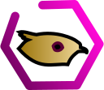
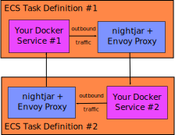

# nightjar-mesh

An AWS ECS Control Plane with Envoy Proxy

*That's a fancy way to say that Nightjar monitors AWS Elastic Cloud Services for changes, and sends updates to a local Envoy Proxy to update the traffic routes.*

## About

[Nightjar](https://en.wikipedia.org/wiki/Nightjar) is a *control plane* for [Envoy Proxy](https://envoyproxy.github.io/envoy/), designed to run within the Amazon Web Services (AWS) ecosystem.  It uses [AWS Cloud Map](https://aws.amazon.com/cloud-map/) to configure how the Envoy *data plane* operates within the Elastic Cloud Services (ECS).



Nightjar loads the service configuration defined in [AWS Cloud Map](https://docs.aws.amazon.com/cloud-map/latest/dg) and updates the Envoy Proxy configuration.  It then periodically scans AWS for updates and changes Envoy as the network changes.  Nightjar works both for network traffic entering the data plane and for traffic within the plane.


AWS provides their [App Mesh](https://aws.amazon.com/app-mesh/) tooling, but it involves many limitations that some deployments cannot work around, or should not work around.  Nightjar acts as a low-level intermediary between the AWS API and the Envoy Proxy to make deployments in EC2 or Fargate possible, with little fuss.  It even works without `awsvpc` networks, and takes advantage of ephemeral ports.  Additionally, the envoy configuration Nightar generates is completely configurable.


## Some Notes on Terminology

For the purposes of these documents, the phrase **service mesh** refers to the set of services that communicate with each other through private channels.  Normally this is called a "cluster", but that word is avoided here because of the many different AWS services that have their own meaning of the word (i.e. an ECS cluster, which is very different).  It's possible to run multiple service meshes that communicate with each other, but these should communicate only through public routes. 
 
Envoy manages the **data plane**, which refers to the control of the flow of network traffic between the services within the service mesh.  The Envoy Proxy documentation describes all the goodness that the tool provides.  Nightjar gives you the flexibility to adjust the Envoy configuration to exactly suit your needs.

The **control plane** manages the configuration of the data plane.

**Nightjar** refers to the control plane tool, while **nightjar-mesh** refers to the Nightjar docker sidecar, the network topology, and the AWS resources used in the construction of the mesh.  Nightjar, additionally, provides two deployment implementations, **standalone** and**centralized** modes.


## How It Works

You add the Nightjar container to an [ECS Task Definition](https://docs.aws.amazon.com/AmazonECS/latest/developerguide/task_definitions.html), along with your existing service container.  The Nightjar container runs the Envoy proxy, and is considered a "sidecar" container here.  The service must be configured to send all traffic to other services in the service mesh to the Nightjar container.  Inbound traffic to the service comes from the Nightjar containers running in the other services. 

You also need to register your ECS service in an AWS Cloud Map namespace, using SVR registration.  Nightjar reads the [service name](https://docs.aws.amazon.com/cloud-map/latest/dg/working-with-services.html) information for each service registered under a single [namespace](https://docs.aws.amazon.com/cloud-map/latest/dg/working-with-namespaces.html), transforms that into a [common data format](nightjar-base/nightjar-src/python-src/nightjar/cloudmap_collector/service-data-schema.yaml), and uses that data with template files to generate envoy proxy files.

You can also have Nightjar run as a gateway proxy.  This does not run as a sidecar, but instead as a standalone container, usually with an AWS Application Load Balancer (ALB) running in front of it.

There are two modes in which Nightjar runs, standalone and centralized.

### Standalone Mode

*[Details for standalone mode](README-standalone.md)*

In standalone mode, the Nightjar sidecar and gateway proxies are independent of each other.  They each read from the AWS Cloud Map configuration and create their own proxy configuration.  This means that problems with one container do not escalate to other containers.  Additionally, all configuration of the mesh is defined within the Cloud Formation templates, if you use those.  It works well for small deployments.

This implementation has some downsides:

* Changing the envoy proxy configuration requires creating new nightjar-standalone docker images.  If you want different configurations for different purposes, then you will need to create one docker image for each purpose.
* The generated envoy proxy files can only be checked by extracting them out of the container, which requires direct access to the docker daemon.  For services running in Fargate, this is not possible.
* As the number of running services goes up, you incur an additional fee from the API usage from AWS.  Some shops may find this fee minimal, while others may consider it too costly.  You need to decide for yourself.  [Here is some information to help you out.](nightjar-standalone/README.md#api-usage)


### Centralized Mode

*[Details for centralized mode](README-centralized.md)*

In centralized mode, the service configuration is broken up.

* The envoy configuration [mustache templates](https://en.wikipedia.org/wiki/Mustache_%28template_system%29) are placed in a data store.  Currently, only S3 is supported as a data store.
* One container runs in [configurator mode](nightjar-central/configurator-docker).  This performs the loop to check for updates to the Cloud Map configuration, generates the envoy configuration files, and stores the generated configuration files in the data store.  A future direction might add in the ability to run this as a Lambda.  This allows the configuration to be generated on demand, with only a single pass on the AWS Cloud Map API.
* Each service and each gateway runs a nightjar-central-envoy sidecar container.  This container checks the data store for updated configuration files.

The storage and retrieval of the configuration files is done atomically, so that no enovy configuration runs in a partial state.

This implementation allows for visibility into the generated envoy proxy files, control over which configuration each gateway and service uses from a centralized store, and minimal impact on Cloud Map API usage.


## Configuring Cloud Map

Each service mesh will need to have its own Cloud Map namespace.  In Cloud Formation Templates, you would define it using the `AWS::ServiceDiscovery::PrivateDnsNamespace` resource type.

Each service in the mesh needs to be defined in a [Cloud Map service](https://docs.aws.amazon.com/cloud-map/latest/dg/working-with-services.html), with SVR DNS records.  Additionally, one [instances](https://docs.aws.amazon.com/cloud-map/latest/dg/working-with-instances.html) within those services must be registered with ID `service-settings` and the given keys:

* `SERVICE` - the name of the service.
* `COLOR` - the deployment "color" (usually blue or green).
* `AWS_INSTANCE_IPV4` and `AWS_INSTANCE_PORT` - these keys are required by AWS, but the value doesn't matter for the purposes of Nightjar.
* For each path prefix that the service handles, register that path as the key, and the relative weight that this service instance should be assigned to that prefix.  For example, if the "blue" deployment has just been released and you want to lightly load it before switching over, give its paths a number significantly lower than the "green" deployment.  If the path is explicitly only used within the service mesh, and should never be accessible from outside this mesh, then prepend a question mark ('?') to the start of the key.  Note that to be recognized as a path key, the key must start with a `/`, `?`, or `*`.

(Note that the explicit instance registration has a small AWS fee associated with it.)

Then each ECS service must be registered to the service.

Here is an example Cloud Formation template that incorporates one service ("tuna", in the "blue" deployment color) in the service mesh namespace ("fish.service.local").

```yaml
Parameters:
  ClusterName:
    Type: String
    Description: >
      The ECS cluster name or ARN in which the image registry task will run.

  VPC:
    Type: AWS::EC2::VPC::Id
    Description: >
      The VPC to connect everything to.

Resources:
  # The namespace for this mesh.  If we have multiple meshes, each one has its
  # own namespace.  The primary reason to split separate clusters is due to
  # overlapping listening paths for the services.  Another reason is better network
  # traffic control.  It can also add extra security by limiting which paths
  # an outside service can talk to by use of the "private" paths. 
  FishNamespace:
    Type: "AWS::ServiceDiscovery::PrivateDnsNamespace"
    Properties:
      Description: "The Fish Mesh"
      Name: "fish.service.local"
      Vpc: !Ref VPC

  # All the different color deployments of the Tuna have their
  # own discovery record.  
  TunaBlueServiceDiscoveryRecord:
    Type: 'AWS::ServiceDiscovery::Service'
    Properties:
      Name: tuna-blue
      DnsConfig:
        NamespaceId: !Ref "FishNamespace"
        DnsRecords:
          # Containers add themselves into this record, and with the SRV
          # type, they register the IP and the ephemeral port they listen on. 
          - Type: SRV
            TTL: 300
      HealthCheckCustomConfig:
        FailureThreshold: 1

  # The ECS service definition including the service registration.
  TunaBlueService:
    Type: "AWS::ECS::Service"
    Properties:
      Cluster: !Ref "ClusterName"
      DeploymentConfiguration:
        MaximumPercent: 200
        MinimumHealthyPercent: 100
      DesiredCount: 1
      LaunchType: EC2
      TaskDefinition: !Ref "TunaBlueTaskDef"
      ServiceRegistries:
        - RegistryArn: !GetAtt "TunaBlueServiceDiscoveryRecord.Arn"
          # The container name and port of the service within the task definition we're registering.
          ContainerName: service
          ContainerPort: 3000

  # A data-only service discovery instance.  Each discovery service includes
  # one of these to tell Nightjar additional meta-data about the specific
  # service.  This includes the different paths.
  TunaBlueReferenceInstance:
    Type: AWS::ServiceDiscovery::Instance
    Properties:
      # The instance ID MUST be "service-settings"; Nightjar looks for this ID.
      InstanceId: service-settings
      ServiceId: !Ref "TunaBlueServiceDiscoveryRecord"
      InstanceAttributes:
        # High level information about the service/color.
        SERVICE: tuna
        COLOR: blue

        # If your service uses HTTP2, then set this attribute and value.
        HTTP2: enabled
        
        # List of all the URI path prefixes that receive traffic as the
        # keys, and the value is the relative weight to assign this
        # service/color for this path.
        "/tuna": "100"
        
        # Note that the paths weights above can be changed outside this file,
        # through the Cloud Map UI or through the AWS cli.


        # These settings are required for SRV records, but for this
        # meta-data record, the values are never used.  So we set these to
        # valid values that are harmless.
        AWS_INSTANCE_IPV4: 127.0.0.1
        AWS_INSTANCE_PORT: 1234
```


## Large Deployment Considerations

Large deployments may need to separate groups of services to have better security and versioning (private, protected, and public APIs), as well as give better independence to groups of services.

In these style deployments, Nightjar can use the gateway service as the entry-point between service meshes.  These can be managed independently of public entry-points.

With Nightjar, you can define the envoy sidecar to redirect other service mesh services directly, which ignores the private paths (paths defined as starting with `?`; see above).

Currently, Nightjar does not itself provide functionality to direct service requests to a single gateway.  However, this can be done through a custom envoy container, or directing the service to reference the ALB.  If you desire Nightjar to support a single gateway as the endpoint for an entire service mesh, please direct a feature request to the issues.  Initial design is to require the gateway to also register itself as a service, and allow for a configuration of Nightjar to direct all requests on a listener port to the instances in that one service.
