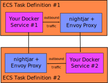
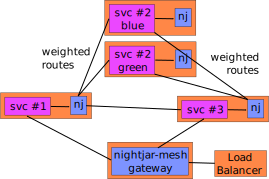

# nightjar-mesh

Yet Another Control Plane with Envoy Proxy (currently focused on supporting AWS services)

*That's a fancy way to say that Nightjar monitors AWS Elastic Cloud Services for changes, and sends updates to a local Envoy Proxy to update the traffic routes.*

## About

[Nightjar](https://en.wikipedia.org/wiki/Nightjar) is a low-level *control plane* for [Envoy Proxy](https://envoyproxy.github.io/envoy/) that uses a file-based approach to allow for transparency in the envoy configuration.

Nightjar loads the locations of all the services throughout the service meshes, then transforms those from a template into the Envoy Proxy configurations.  It then periodically scans for updates and changes Envoy as the network changes.

Nightjar works both for network traffic entering the data plane and for traffic within the plane.

The construction of the proxy configuration comes from these layers of data:

1. The network definition.  *Defined through the discovery map extension point.*
    1. Which services to use, and where are they?
    1. What URI paths do they respond to, what ports to they listen on, and by how much should the traffic favor this route (weighing)?
1. Access definition.  *Defined in the construction of the service data.*
    1. Which services and other meshes are available to each service and gateway?
    1. Which routes for those services should this allow access to?
1. Envoy configuration.  *Defined in the envoy configuration templates, accessed through the data store extension point.*
    1. Envoy configuration template files, which can be defined at a high level, or specialized on a per service, deployment color, or service-mesh basis.

The services call out to other by sending a request to the Envoy proxy directly, rather than to a DNS name that Envoy reroutes through ip table changes.  This makes the Envoy container setup require fewer docker permissions.

Full information is available in the [documentation area](docs/README.md).

## Supported Infrastructure

Nightjar has a series of well defined data formats that allow it to run with any number of backing technology.  It uses [extension points](docs/extension-points.md), programs with a well-defined interface, to provide integration with other technologies.

### Service Discovery Through AWS Elastic Cloud Services (ECS)

The [AWS ECS extension point](docs/discovery-aws-ecs-task-tags.md) scans ECS clusters for containers that belong to the mesh.  Containers with special tags and environment variables declare their participation in the mesh, and how they work within the mesh.

As a discovery map extension point, it is called frequently to find updates to the mesh, which allows for the Envoy proxy to dynamically change the routing as the cluster changes.

### Data Storage in AWS S3

The [AWS S3 extension point](docs/store-aws-s3.md) stores and retrieves document templates from an S3 bucket.  This allows the Envoy proxy configurations to be updated, and the running proxies dynamically update with the new settings.

Nightjar allows storing the discovery map definition in a data storage extension point, so you can also use this to keep a cached version of the discovery map.  In this way, your Envoy proxies don't need to each run the discovery, but instead can retrieve it from the S3 store.

### Local Container Storage

The [local store extension point](docs/store-local.md) stores and retrieves document templates from the container's local storage.  This can either be files baked into the docker image, or mounted through a volume.

### Service Discovery Through AWS Cloud Map (In Development)

The [AWS Cloudmap extension point](docs/discovery-aws-cloudmap.md) scans the service configuration defined in [AWS Cloud Map](https://docs.aws.amazon.com/cloud-map/latest/dg) to construct the discovery map for locating services within within the AWS Elastic Cloud Services (ECS).

*This is being developed.*

### Bring Your Own Extension Point

If you have other ideas for storage or discovering the mesh, you can follow the simple requirements to write your own extension point.  Want to write it in Golang?  Go for it.  How about Ruby?  Sure.

## Some Notes on Terminology

For the purposes of these documents, the phrase **service mesh** refers to the set of services that communicate with each other through private channels.  Normally this is called a "cluster", but that word is avoided here because of the many different AWS services that have their own meaning of the word (i.e. an ECS cluster, which is very different).  It's possible to run multiple service meshes that communicate with each other, but these should communicate only through public routes. 
 
Envoy manages the **data plane**, which refers to the control of the flow of network traffic between the services within the service mesh.  The Envoy Proxy documentation describes all the goodness that the tool provides.  Nightjar gives you the flexibility to adjust the Envoy configuration to exactly suit your needs.

The **control plane** manages the configuration of the data plane.

**Nightjar** refers to the control plane tool, while **nightjar-mesh** refers to the Nightjar docker sidecar, the network topology, and the AWS resources used in the construction of the mesh.  Nightjar, additionally, provides two deployment implementations, **standalone** and **centralized** modes.

## Nightjar vs. AWS App Mesh

AWS provides their [App Mesh](https://aws.amazon.com/app-mesh/) tooling, but it involves many limitations that some deployments cannot work around, or should not work around.  Nightjar acts as a low-level intermediary between the AWS API and the Envoy Proxy to make deployments in EC2 or Fargate possible, with little fuss.  It even works without `awsvpc` networks, and takes advantage of ephemeral ports.  Additionally, the envoy configuration Nightar generates is completely configurable, which gives you flexibility to take advantage of many Envoy features without needing to wait for AWS to support them.

## How It Works

Nightjar expects each service to have an Envoy proxy sidecar running through the [Nightjar container](docs/entry-standalone.md).  The Nightjar container configures the Envoy proxy, and ensures it stays running.  The configuration involves:

1. running the [discovery-map extension point](docs/extension-points.md#discovery-maps) to retrieve the mesh configuration;
1. running the [data-store extension point](docs/extension-points.md#data-store) to retrieve the Envoy template files;
1. convert the discovery-map to a form that is specialized to the current container and ready for processing through the templates;
1. process each template as a mustache template, using the converted discovery-map.

The service container needs to be configured to send requests for the mesh to the Nightjar container.

The data-store extension point is specially designed to allow it to also work as a discovery-map extension point.  That means you can have a separate [central container](docs/entry-central.md) generate the discovery-map and store it in the data store, while the [sidecar container](docs/entry-standalone.md) pulls from the data store.  This can help if you find that there are request limits or costs associated with mesh discovery.

## Get Started with Examples

* [Running Local](examples/simple-mesh) - Run from docker-compose with local storage.  This shows a gradual introduction of more Nightjar features.
* [AWS ECS and S3](examples/aws-ecs-tags) - Run within an ECS cluster.
