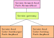

# Simple Mesh Example

In this example, we construct a simple mesh based on a simple service ([service-key-forward](service-key-forward)).  We'll be running nightjar through docker-compose entirely from your local computer.

The service itself is configured through environment variables:

* `KEYS` - Comma-separated list of "keys".  Each key is assigned a path, in the form `/key/${key}`, and it returns the JSON data `{"key":"${${key}_VALUE}"}`.
* `${key}_VALUE` - the response for the request to the key from `KEYS`.  If not given, then the response will be the key name itself.
* `FORWARD_KEYS` - Comma-separated list of environment variable `keys`, which make up a path and URL to forward to.  Requests to `/forward/${key}` cause the service to make a request to the URL defined in the environment variable `${key}_URL`.  Its response and status code are returned to the caller.
* `${key}_URL` - Path part of the `FORWARDED_KEYS` key element, where `${key}` is the upper-case version of the key.

This simple setup allows us to create complex meshes.
 
## Example 0: No Mesh

In this case we will simply use two services with no mesh:

* Forwarder F1
    * Service: f1
    * Color: blue
    * Path: `/forward/f1` forwards to `/key/s1`
    * Path: `/key/f1`
* Service S1
    * Service: s1
    * Color: blue
    * Path: `/key/s1`

This very simple setup is detailed in [docker-compose-00.yaml](docker-compose-00.yaml).  This just shows off how the service behaves before we get into using the nightjar mesh.

Once you start up the configuration:

```bash
$ docker-compose -f docker-compose-00.yaml up
```

This compose file simply has the f1 service connect directly to the s1 service.  Likewise, there's no gateway into the mesh, so you must contact each one directly.  You can then run REST API requests against each one of those instances. 

```bash
$ curl http://localhost:3001/forward/f1
{"key":"s1"}
$ curl http://localhost:3002/key/s1
{"key":"s1"}
$ curl http://localhost:3001/key/f1
{"key":"f1"}
```

## Example 1: Introduce Nightjar

For the next example, we'll need the stand-alone version of nightjar's docker image built locally.

```bash
$ docker build -t local/nightjar-standalone -f ../../src/Dockerfile.envoy-standalone ../../src
```

Then we start [docker-compose-01.yaml](docker-compose-01.yaml) to introduce nightjar as a gateway.  In this case, because the mesh is so simple, the gateway is being shared between all the services as also the sidecar.

```bash
$ docker-compose -f docker-compose-01.yaml up
```

This docker-compose file turns off host access to the services, so you must go through the gateway (port 3000) to access them:

```bash
$ curl http://localhost:3000/forward/f1
{"value":"s1"}
$ curl http://localhost:3000/key/s1
{"value":"s1"}
$ curl http://localhost:3000/key/f1
{"value":"f1"}
```

The nightjar configuration uses an entirely local file version of nightjar, where the templates and discovery map are stored in local files.  This is because the docker-compose setup pattern creates a static mesh.  The nightjar configuration's environment variables declare that:

* the discovery map is stored in the file [`01-discovery-map.json`](nightjar-standalone-local/01-discovery-map.json), and is accessed through a data store, rather than a discovery map generator.  This is a simplification of the model, where by specially configuring the discovery service extension point, the data store can be reused.  In this case, we're using a data store that reads files from the container's file system.
    * env `DISCOVERY_MAP_EXEC` - set the command that runs a discovery-service compatible executable.
    * env `NJ_DSLOCAL_FILE_DISCOVERY_MAP` - used by the data store to find the discovery file.
* the data store templates are stored in the file [`01-templates.json`](nightjar-standalone-local/01-templates.json)
    * env `DATA_STORE_EXEC` - set the command that runs the data store compatible executable.  For the standalone mode, it is only explicitly called to get the templates.
    * env `NJ_DSLOCAL_FILE_TEMPLATES` - used by the data store to find the templates file.
    * file `01-templates.json` contains the template file [`01-envoy-config.yaml.mustache`](nightjar-standalone-local/01-envoy-config.yaml.mustache) inside the json file.
* The Envoy proxy listens on port 3000 for HTTP requests and port 3001 for administration access.
    * env `NJ_LISTEN_PORT`
    * env `NJ_ADMIN_PORT`

The use of local files makes a docker-compose version of the mesh possible, and also simplifies the setup process.  It does, however, mean that updates to the configuration require pushing files into the docker container.  For this situation, though, the template configuration of Envoy is a static setup, so it doesn't ever pick up changes to the configuration.  So, let's try out dynamic configuration next.


## Example 2: Dynamic Configuration

For this example, we're still running entirely local with static files in the docker container, and the same service setup.  However, we'll switch up the envoy configuration to instead use dynamic configuration.  This is done entirely through the template setup.  Most setups of nightjar will use this kind of setup.  As it is a bit more complex (uses several template files), only this example will use it.

Starting up the docker compose configuration:

```bash
$ docker-compose -f docker-compose-02.yaml up
```

This time, the templates are setup differently to have 3 different Envoy files generated from the discovery map.  But the effect is still the same.

But now let's show off the dynamic configuration.  With docker-compose still running, we'll replace the discovery map with one that doesn't allow access to the `/key/f1` route.  This assumes that the docker-compose starts up the gateway container with the name `simple-mesh_gateway_1`; you may need to adjust this for your configuration.

```bash
$ docker cp nightjar-standalone-local/02a-discovery-map.json simple-mesh_gateway_1:/nightjar/local/02-discovery-map.json
```

Nightjar will pick up the change after a bit of time (it refreshes the configuration every 30 seconds).  When it does, the request to the `/key/f1` no longer works.

```bash
$ curl -v http://localhost:3000/key/f1
*   Trying 127.0.0.1:3000...
* Connected to localhost (127.0.0.1) port 3000 (#0)
> GET /key/f1 HTTP/1.1
> Host: localhost:3000
> User-Agent: curl/7.71.1
> Accept: */*
>
* Mark bundle as not supporting multiuse
< HTTP/1.1 404 Not Found
< date: Fri, 11 Jul 2001 10:23:00 GMT
< server: envoy
< content-length: 0
<
* Connection #0 to host localhost left intact
```

## Example 3: Weighted Routing / Canary Testing

Now let's get to an interesting variation.  Let's start up the next example:

```bash
$ docker-compose -f docker-compose-03.yaml up
```

In this situation, we have two services with different "colors" sharing the same route, and the forwarder routing to that shared route.

 

Here, the services are configured as:

* Forwarder
    * Service: forwarder-food
    * Color: default
    * Path: `/forward/food` forwards to `/key/food`
    * Path: `/key/services` returns the value `food`
* Service food-hamburger
    * Service: food
    * Color: hamburger
    * Path: `/key/food` returns the value `hamburger`, with a weight of 1
* Service food-hotdog
    * Service: food
    * Color: hotdog
    * Path: `/key/food` returns the value `hotdog`, with a weight of 2

This configures the Envoy gateway proxy to decide how to route that shared path between the two services.  Due to the weight differences, we should expect to see requests to the path return `hotdog` about two out of every three times, and `hamburger` one out of three.

```bash
$ curl http://localhost:3000/forward/food
```

This is the general technique for canary testing.  The new service (hamburger) is being brought up to replace the old one.  You can then dynamically change the weight of the paths to route more and more traffic to the new service, until you think it's safe to remove the old one.
